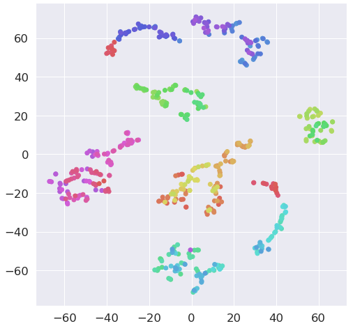

# tsne를 이용한 고차원 벡터 시각화

- code
<iframe
  src="https://carbon.now.sh/embed/?bg=rgba(255%2C255%2C255%2C1)&t=monokai&wt=none&l=python&ds=false&dsyoff=20px&dsblur=68px&wc=true&wa=true&pv=56px&ph=56px&ln=false&fl=1&fm=Fira%20Code&fs=14px&lh=152%25&si=false&es=2x&wm=false&code=import%2520seaborn%2520as%2520sns%250Aimport%2520matplotlib.pyplot%2520as%2520plt%250Afrom%2520sklearn.manifold%2520import%2520TSNE%250A%250Asns.set_style('darkgrid')%250Asns.set_palette('muted')%250Asns.set_context(%2522notebook%2522%252C%2520font_scale%253D1.5%252C%2520rc%253D%257B%2522lines.linewidth%2522%253A%25202.5%257D)%250Alabels%2520%253D%2520%255Bstr(i)%2520for%2520i%2520in%2520range(len(except_embedding)%252B1)%255D%250Atsne_train_xs%2520%253D%2520TSNE(n_components%253D2%252C%2520verbose%253D1%252C%2520perplexity%253D6%252C%2520n_iter%253D1000).fit_transform(except_embedding%252C%2520labels)%250Aplt.figure(figsize%253D(8%252C%25208))%250Aplt.scatter(x%2520%253D%2520tsne_train_xs%255B%253A%252C0%255D%252C%2520y%253Dtsne_train_xs%255B%253A%252C1%255D%252C%2520color%253Dsns.color_palette(%2522hls%2522%252C%2520len(except_embedding)))%250Aplt.show("
  style="transform:scale(0.9); width:1024px; height:473px; border:0; overflow:hidden; margin: 0px;"
  sandbox="allow-scripts allow-same-origin">
</iframe>

- 결과
</img>